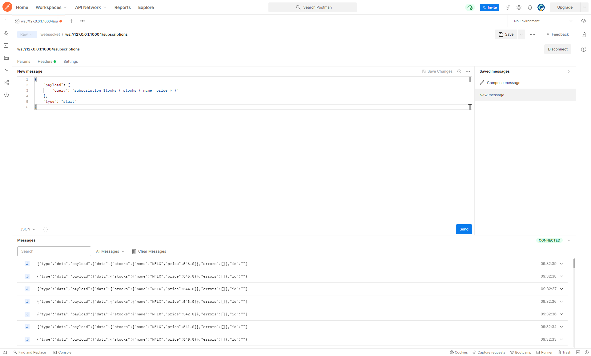

# DGS

- [DGS](https://netflix.github.io/dgs/)
- [DGS Github](https://github.com/Netflix/dgs-framework)

## module description

| Module                                 | 说明                                                                                                               |
|----------------------------------------|------------------------------------------------------------------------------------------------------------------|
| [✅a-start](./a-start)                  | Example of multiple `*.graphqls`，@DgsData.List                                                                   |
| [✅b-codegen](./b-codegen)              | Example of codegen，multiple modules，methods in type，使用constant in @DgsData，@RequestHeader                        | 
| [✅c-scalar](./c-scalar)                | Example of custom scalar                                                                                         |                                    
| [✅d-http](./d-http)                    | Example of Query，Mutation，Subscription，params validation，Apollo Tracing                                          |           
| [✅e-file](./e-file)                    | Example of file upload                                                                                           |                                     
| [✅f-auth](./f-auth)                    | Example of authentication and authorization                                                                      |                                      
| [✅g-error](./g-error)                  | Example of custom error type                                                                                     | 
| [✅h-ut](./h-ut)                        | Example of uni test, integration test, unit test of supporting custom scalar                                     | 
| [✅i-nplusone](./i-nplusone)            | Example of `N+1`, support custom tracing                                                                         | 
| [✅j-sample](./j-sample)                | Example of split Query and Mutation into different configruation files to avoid too many definitions in one file |
| [k-postg](./k-postg)                   | Example of supporting PostGraphile（Experimental）                                                                 |
| [✅l-interfaceunion](./l-interfaceunion) | Example of interface and union                                                                                   |
| [✅m-dynamicschema](./m-dynamicschema)   | Example of dynamic schema                                                                                        |
| [✅y-bff](./y-bff)                      | Example of Client and Server，support voyager                                                                     | 
| [✅z-domain](./z-domain)                | Example of Client and Server，support voyager                                                                     |

## Intellij Idea Plugin

- [GraphQL](https://plugins.jetbrains.com/plugin/8097-graphql)
- [DGS](https://plugins.jetbrains.com/plugin/17852-dgs)

## a-start

- Startup then visit http://localhost:10001/graphiql
- Input

```
{
    shows {
        title
        releaseYear
    }
}
------
{
  shows(titleFilter: "Ozark") {
    title
    releaseYear
  }
}
------
{
  showsWithDgsData {
    id
    title
    releaseYear
    actors {
      name
    }
  }
}
------
{
  user {
    id
    name
  }
}
```

## b-codegen

- root build.gradle

```
plugins {
    id "com.netflix.dgs.codegen" version "5.1.17" apply false
}
```

- module build.gradle

```
plugins {
    id "com.netflix.dgs.codegen"
}
```

- module build.gradle

```
generateJava{
    schemaPaths = ["${projectDir}/src/main/resources/schema"] // List of directories containing schema files
    packageName = 'com.codegen.graphqldgs' // The package name to use to generate sources
    generateClient = true // Enable generating the type safe query API
}
```

- check build folder
- Input，visit http://127.0.0.1:10002/graphiql

```
{
  shows {
    id
    title
    releaseYear
  }
}
------
{
  shows(titleFilter: "Ozark") {
    id
    title
    releaseYear
  }
}
```

## c-scalar

- Input，visit http://127.0.0.1:10003/graphiql

```
{
  shows {
    id
    title
    releaseYear
    price
    dateTime
    bigDecimal
    uuid
  }
}
```

## d-http

- Startup，visit http://127.0.0.1:10004/graphiql
- Input

```
{
  show(people: {name: "zhangsan"}) {
    id
    name
  }
  shows(personList: [{name: "zhangsan"}]) {
    id
    name
  }
}
------
{
  showWithGood {
    id
    name
  }
}
------
{
  showWithGood(good: {name: "Car"}) {
    id
    name
  }
}
------
mutation {
  addRating(title: "title", stars: 100) {
    avgStars
  }
  addRatingWithInput(input: {title: "title", stars: 200}) {
    avgStars
  }
}
------
mutation {
  addRating(title: "title", stars: 100) {
    avgStars
  }
  addRatingWithInput(input: {title: "hel", stars: 200}) {
    avgStars
  }
}
```

Use `Postman` to visit `Subscription`


## e-file

- Startup
- Input with `curl`

```
curl localhost:10005/graphql \
  -F operations='{ "query": "mutation upload($file: Upload!) { upload(file: $file) }" , "variables": { "file": null } }' \
  -F map='{ "0": ["variables.file"] }' \
  -F 0=@1.png
------
curl localhost:10005/graphql \
  -F operations='{ "query": "mutation addArtwork($file: Upload!) { addArtwork(file: $file) }" , "variables": { "file": null } }' \
  -F map='{ "0": ["variables.file"] }' \
  -F 0=@1.png

```

- Output

> Please check `project uploaded-images` folder

```
{"data":{"upload":true}}
------
{"data":{"addArtwork":true}}
```

## f-auth

- Startup，visit http://localhost:10006/graphiql
- Input

```
{
  salary
}
------
{
  salary
}
# REQUEST HEADERS中Input{ "Authorization": "Basic aHI6aHI=" }，This is hr username and password
------
mutation {
  updateSalary(salaryInput: {employeeId: "1", newSalary: "100"}) {
    id
    employeeId
    newSalary
  }
}
------
mutation {
  updateSalary(salaryInput: {employeeId: "1", newSalary: "100"}) {
    id
    employeeId
    newSalary
  }
}
# REQUEST HEADERS中Input{ "Authorization": "Basic aHI6aHI=" }，This is hr username and password
```

## g-error

- Startup，visit http://localhost:10007/graphiql
- Input

```
{
  show(people: {name: "haha"}) {
    id
    name
  }
}
------
{
  show(people: {name: "zhangsan"}) {
    id
    name
  }
}
------
{
  getRating(id: "1") {
    avgStars
  }
}
```

## h-ut

> see `test` folder

- Run `DemoControllerTests` and `ShowDataFetcherTest` to check

## i-nplusone

- Startup，visit http://localhost:10009/graphiql
- Input

```
{
  shows {
    showId
    title
    reviews {
      starRating
    }
  }
}
------
{
  showsN {
    id
    title
    releaseYear
    artwork {
      url
    }
    reviewsN {
      username
      starScore
      submittedDate
    }
  }
}
```

## l-interfaceunion

- Startup then visit http://localhost:10012/graphiql
- interface input

```
{
  movies {
    __typename
    ... on ActionMovie {
      title
      nrOfExplosions
    }
    ... on ScaryMovie {
      title
      gory
      scareFactor
    }
  }
}
```

- union input

```
{
  search {
    __typename
    ... on Actor {
      name
    }
    ... on Series {
      title
    }
  }
}
```

## m-dynamicschema

- Startup then visit http://localhost:10013/graphiql
- Input

```
query randomNumber {
  randomNumber(bound: 10)
}
------
mutation createUser {
  createUser(username: "hello", password: "world") {
    id
    username
    password
  }
}
```

## y-bff

- Startup，Startup module `z-domain`，visit http://localhost:20000/graphiql
- Startup, Startup module `z-domain`，visit http://localhost:20000/voyager
- Input

```
{
  shows {
    id
    title
    releaseYear
  }
}
------
mutation {
  addShow(input: {title: "title", releaseYear: 2022}) {
    id
    title
    releaseYear
  }
}
```

## z-domain

- Startup，visit http://localhost:20001/graphiql
- Startup，visit http://localhost:20001/voyager
- Input

```
{
  shows {
    id
    title
    releaseYear
  }
}
------
mutation {
  addShow(input: {title: "title", releaseYear: 2022}) {
    id
    title
    releaseYear
  }
}
```
